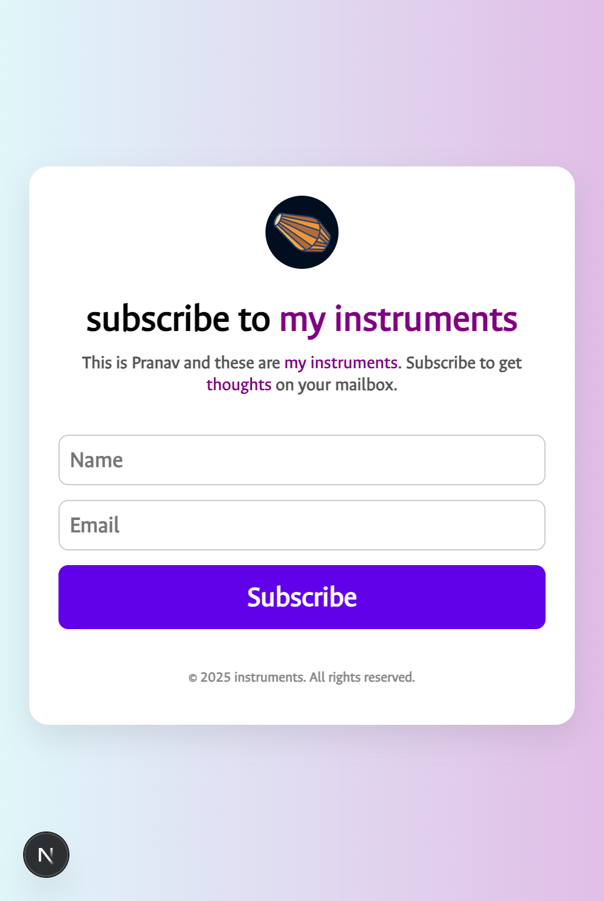

# 🎵 My Instruments – Newsletter Signup App

A simple, responsive **newsletter registration** app built with **Next.js**.

---

## 🚀 Features

- ✅ Responsive design with modern layout
- ✅ `Ancizar Sans` typography with custom branding
- ✅ Name and Email collection
- ✅ Interactive feedback for subscription
- ✅ Logo and gradient placeholders ready
- ✅ Styled using CSS Modules
- ✅ Backend integration with `/api/subscribe`
- ✅ Deployable on Vercel or any Node platform

---

## 📸 Preview



---

## 🧰 Tech Stack

- [Next.js](https://nextjs.org/)
- [CSS Modules](https://nextjs.org/docs/basic-features/built-in-css-support)
- [Google Fonts: Ancizar Sans](https://fonts.google.com/specimen/Ancizar+Sans)
- Vanilla JS + Fetch API

---

## 📦 Getting Started

```bash
# 1. Clone the repo
git clone https://github.com/pranavatpeaks/my_instruments.git
cd my_instruments

# 2. Install dependencies
npm install

# 3. Run locally
npm run dev
